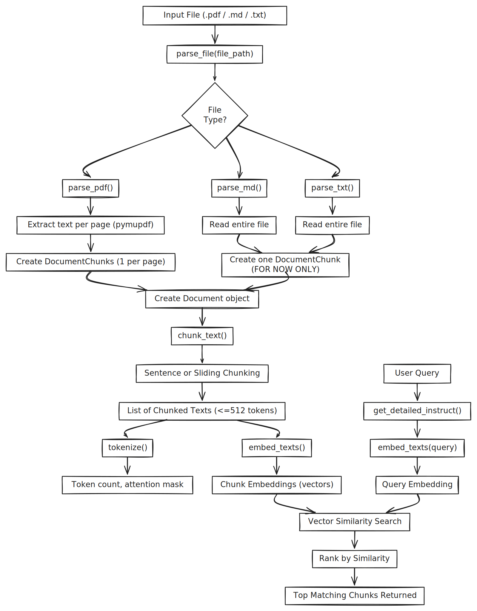

# 🧠 mentis-local
`mentis-local` is a lightweight, local LLM + RAG system that's designed to simulate the interactions of a human memory. Mentis aims to explore how local language models and semantic search can be used to  explore organize personal knowledge, surface hidden connections between ideas, and enable context-aware interaction with your local files.


## 🧪 MVP Goal

The short-term goal is a lightweight CLI (or basic web UI) that can:
- Parse and index your local notes (`.md`, `.txt`, `.pdf`)
- Use embeddings + retrieval to find relevant chunks
- Send structured prompts to a user-configurable local LLM
- Return useful, context-aware responses


## 🌱 Long-Term Direction
> The vision is to build something closer to an augmented memory than a chatbot: a system that helps you recall, link, and expand on what you already know, write, or think.
> Over time, the system might even learn to observe patterns in your usage and simulate meaningful variation or randomness: the kind you'd expect from a real memory, not a static database.


## 🔧 Current Progress

### ✅ Archivum Core (Completed)
- [x] `tokenizer_utils.py` — Tokenizer loading, tokenization utilities
- [x] `document.py` — Document and chunk structures
- [x] `parser.py` — PDF/Markdown/Text file parsing
- [x] `chunker.py` — Sentence-based and sliding window chunking
- [x] `embedder.py` — Embedding with E5 instruction models
- [x] `db.py` — Vector database storage and querying
- [x] `ingest.py` — Ingestion pipeline
- [x] `query.py` — Basic semantic retrieval
- [x] Logging / diagnostics: Track timing, chunk counts, retrieval hits


### 🛠 Mentis Extensions (In Progress)
- [ ] `query.py` — Advanced retrieval + prompt formatting
- [ ] `llm_interface.py` — Interface with local LLM (e.g., Gemma 4B)
- [ ] `interface.py` — Basic CLI or minimal Web UI
- [ ] Prompt templates and augmentation logic
- [ ] Memory simulation modules (optional future)
- [ ] Implement encryption to support safe, private syncing of knowledge to the cloud


## 📊 Current Pipeline

The following diagram outlines the current end-to-end data flow in `mentis-local`, showing the processes from file ingestion to embedding:



> See: `diagrams/pipeline.svg`
Here's the same examples section but wrapped in collapsible `<details>` blocks — works great in GitHub `README.md` files for keeping things tidy while still showcasing depth.

---

## 🔍 Example Inputs & Retrieval Results

> Below are example queries and retrieval results using `mentis-local`.


<details>
<summary>📘 Treaty of Versailles (Markdown)</summary>

**Query:**  
> *What economic obligations did the Treaty of Versailles impose on Germany, and how were these justified by the Allies?*

**🧠 Top 3 Results:**
```
[85.54] The treaty required Germany to compensate the Allied powers, and it also established an Allied "Reparation Commission" to determine the exact amount which Germany would pay and the form th...

[85.30] Eventually, even under the "cruel" terms of the Treaty of Versailles, Germany's economy had been restored to its pre-war status...

[86.02] Article 1 of this treaty obliged the German government to grant to the U.S. government all rights and privileges that were enjoyed by the other Allies that had ratified the Versailles treaty...
```

</details>


<details>
<summary>🧠 ImageNet CNN (PDF)</summary>

**Query:**  
> *Explain how the architectural choices in the 2012 ImageNet CNN (e.g. ReLU, local response normalization, overlapping pooling, two-GPU training) contribute to reducing overfitting and training time.*

**🧠 Top 3 Results:**
```
[87.23] Current GPUs, paired with optimized 2D convolution, are powerful enough to facilitate training of large CNNs...

[86.81] Training one CNN, with an extra sixth convolutional layer over the last pooling layer, to classify the entire ImageNet Fall 2011 release...

[86.28] To reduce overfitting in the fully-connected layers we employed a recently-developed regularization method called “dropout”...
```

**Follow-up Query:**  
> *What techniques were used in the paper to reduce overfitting during training?*

```
[88.86] To reduce overfitting in the fully-connected layers we employed a recently-developed regularization method called “dropout”...

[88.55] Overfitting was a significant problem, even with 1.2M labeled examples, so we used several techniques to prevent it...

[85.84] Improving neural networks by preventing co-adaptation of feature detectors...
```

</details>


<details>
<summary>🇨🇦 Canadian Federal Budget 2024 (PDF)</summary>

**Query:**  
> *Has the Canadian government proposed ways to make capital more accessible for First Nations businesses?*

**🧠 Top 3 Results:**
```
[89.13] The government is offering more flexible options for Indigenous Peoples to exercise tax jurisdiction; providing support for entrepreneurship...

[88.16] The government wants to encourage Canadian businesses to invest in capital—both tangible and intangible—to boost productivity...

[87.41] Indigenous communities need fair access to affordable capital that meets their unique needs...
```

**Follow-up Query:**  
> *What specific funding programs has the Canadian government proposed to support Indigenous or First Nations businesses, including names of programs and dollar amounts?*

```
[88.32] Budget 2024 proposes to provide $350M for the development of an Economic Reconciliation Framework and a National Benefits-Sharing Framework...

[87.54] Up to $265M for the Black Entrepreneurship Program...

[87.30] $275M over two years to Indigenous Services Canada to support First Nations governance and self-determination...
```

</details>


## 🛠️ Principles

I am using this project to learn more about how these different technologies work, so I set the following design principles to guide my learning and the implementation of this project:

- **Keep abstraction low** — preference to write light-weight code rather than importing packages. keep the code low-level and easy to understand.
- **Local-first** — no cloud, no APIs, everything runs on your machine, and your data is only yours and should not leave to any third party.
- **Modular by default** — components should be easy to test, swap, or extend without breaking the rest of the system.

If you are interested in reading more details 
> See: `docs/designprinciples.md`


## 📝 Future Writing

This has been a very fun and interesting project to working on so far. I'm planning to write a few short articles to reflect on this project, covering both technical and conceptual aspects:

- How retrieval-augmented generation models simulate aspects of memory
- Designing low-abstraction NLP pipelines for learning and extensibility
- Thoughts on cognitive systems, externalization, and AI-assisted thinking

